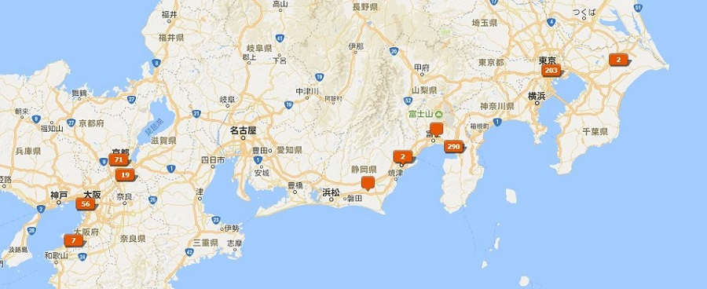

# 霓虹霓虹
*Silensmile's Travel of Japan* 
*游记 以及 大家想要的攻略*  

## 0 序言
大四毕业之际，**最后**一段难得的大把时间，想和高中小伙伴商量着去稍微远一些的地方浪，以后估计就没有什么机会了。由于资金限制，就只考虑了亚洲，相比东南亚、印度地区，还是选择了日本这个临近的发达国家。加之同行的或多或少有宅的属性，就欣然统一意见了。  
日本出游这一系列计划是在17年5月开始准备的（说是开始准备也只是建了个微信讨论组），由于可种各样的原因（毕业相关事务、导师工作任务，等），出行成员直到6月末才确定下来。 
*中途有三四个人先后鸽了，对行程和预算有些许影响，这个后文细说明*  
最终经过不懈努力，三人于**2017年7月26日**顺利到达东京成田机场，经过**9夜10日**游历东京都、[沼津](https://en.wikipedia.org/wiki/Numazu,_Shizuoka)、京都、大阪，**8月5日**由大阪关西机场安全返回宜昌。  
下图以旅途中照片GPS位置显示大致到达区域： 
 
看来还是去了不少地方哈~ 
***
本文内容主要分为三个部分:
+ 为这次日本自由行做出的准备工作
+ 自己的日本出游经历与体会
+ 经过这9天的旅行获得的经验与攻略

这也算是给这次旅行留下些纪念  

#### 目录
> + [1 行前](#1-行前)  
>   + [1.1 办理证件](#11-办理证件)
>   + [1.2 预定机票](#12-预定机票)
>   + [1.3 制定行程](#13-制定行程)
>   + [1.4 预定住所](#14-预定住所)
> + [2 游记](#2-游记)
> + 3 攻略

***
## 1 行前
实话说，这次的旅行我是从大四下学期开始的时候就有所打算了，大四下学期也没有什么课了，于是蹭了半年研究生日语初级课。半年下来一周只有一个上午的四节课，语言上也没有学习多少，只算入了门。*（后来事实证明，其实去日本旅游会不会日语关系不大，会英语就OK啦~）* 我到出发之前认得所有的平假名和片假名，只记得一点点词汇和常用语了。  
*旅途中遇到的语言上的问题后文再说*

### 1.1 办理证件
**护照的办理**  
我是在今年三月份在北京办理的护照，由于户口迁到了学校，在北京办护照只要10天就好了。办理过程也很方便，去公安的出入境管理大厅，一两个小时手续就办完了。  
**签证的办理**  
行程大致确定后，6月20号左右在X宝上办理的单次短期旅游签证。在办理签证的期间发现了一些问题： 
+ 办理日本旅游签证需要提供机票凭证、预订酒店凭证以及滞留日期等。然而这时我们并没有把这些材料准备好，但是X宝上面一些办签证的机构不需要这些材料，所以……
+ 高校学生不需要提供要求的工资流水单，也不会因为收入不够拒签。只需要提供学信网上的学籍证明，并且教育部直属的75所高校办理签证还更方便。*脸黑，我航是工信部直属高校，为此我多花了300软妹币*
+ 签证是在南京、上海等地办的，而户口仍在湖北，然而湖北办理签证是属于北京管辖并非上海，这种情况需要提供南京的暂住证。期初准备一起去的一个小伙伴由于这个原因，暂住证办不下来，只好放弃了。
+ 办签证的时候需要寄出护照原件，所以可以照相保存护照上的信息，以便期间购买机票、预定酒店等。

### 1.2 预定机票
机票这一块是个大坑啊！！ 
机票这一块是个大坑啊！！ 
机票这一块是个大坑啊！！ 
本来六月份看好的七月末八月初 *武汉-东京* 以及 *大阪-武汉* 春秋航空的往返直达机票一起就只要1800左右软妹币，当签证稳了,出行人员也都确定的时候（7月2日）再看，往返机票分别涨到了1400和2600，回来只好改成更廉价的乐桃航空机票，然而网上乐桃的风评并不怎么好。之后还算顺利，在台风登陆日本的前两天飞回来了。  
暑期机票涨的太厉害了，岛国还有可能遭遇恶劣天气。所以啊，要是时间允许，最好提前40多天买机票，并且不要选择暑期等旅游高峰期。  
最后往返机票以及国内火车票一共花费3600左右软妹币，机票要早定的话可以减少一千多的开销，内心都在滴血。  
**还有，就是一定要看是否有台风！！！**  
提前看当地天气，感觉都不是很靠谱的样子。国内天气查询平台应该是一个样，国外的有[The Weather Channel](https://weather.com)，地名用英文搜索要准确一些，但是感觉查太久之后的天气也不准。比如出发前看到去玩的四个地方都要下阵雨，结果这十天下来就下了两场小一点的阵雨。*（这也许是队长第一天浅草寺抽到**大吉**的结果_逃了_）* 

### 1.3 制定行程
这一部分的工作全都是借助`Google Maps`完成 *（别跟我说国内上不去）*   
先分配好每个地方要去几天，在详细制定每天的路线计划，查好大致交通路线并记录。`Google Maps`上可以查到日本每一趟铁路和公交线路的具体发车时间和到达每一站的时间，甚至是延误信息，这一点可以说是非常方便了。  
附上我们的行程安排： 

<table>
<thead>
<tr>
<th style="text-align:left">日期</th>
<th style="text-align:left">时间</th>
<th style="text-align:left">内容</th>
<th style="text-align:left">其他</th>
</tr>
</thead>
<tbody>
<tr>
<td style="text-align:left">0726</td>
<td style="text-align:left">9:13</td>
<td style="text-align:left">宜昌东乘火车至汉口(2小时，11:13到站)</td>
<td style="text-align:left">八点半宜昌东集合</td>
</tr>
<tr>
<td style="text-align:left">Beijing</td>
<td style="text-align:left">11:15</td>
<td style="text-align:left">前往天河机场</td>
<td style="text-align:left">轨道交通2号线</td>
</tr>
<tr>
<td style="text-align:left"></td>
<td style="text-align:left">12:20</td>
<td style="text-align:left">到达机场，解决午饭，办理手续</td>
<td style="text-align:left">国际航站楼</td>
</tr>
<tr>
<td style="text-align:left"></td>
<td style="text-align:left">15:10</td>
<td style="text-align:left">飞机飞往东京</td>
<td style="text-align:left"></td>
</tr>
<tr>
<td style="text-align:left">Tokyo</td>
<td style="text-align:left">20:00</td>
<td style="text-align:left">到达东京成田机场</td>
<td style="text-align:left">买东京3 day pass和交通卡</td>
</tr>
<tr>
<td style="text-align:left"></td>
<td style="text-align:left">21:00</td>
<td style="text-align:left">找到住处（东新宿），整理内务，计划安排行程</td>
<td style="text-align:left"></td>
</tr>
<tr>
<td style="text-align:left">0727</td>
<td style="text-align:left">上午</td>
<td style="text-align:left">浅草寺</td>
<td style="text-align:left">32分钟：大江户线（上野御徒町）-银座线（浅草）</td>
</tr>
<tr>
<td style="text-align:left"></td>
<td style="text-align:left">下午</td>
<td style="text-align:left">国立博物馆、上野公园</td>
<td style="text-align:left">24分钟：步行</td>
</tr>
<tr>
<td style="text-align:left"></td>
<td style="text-align:left">傍晚</td>
<td style="text-align:left">新宿周边（新宿御苑）（歌舞伎町）</td>
<td style="text-align:left">返回</td>
</tr>
<tr>
<td style="text-align:left">0728</td>
<td style="text-align:left">上午</td>
<td style="text-align:left">皇居</td>
<td style="text-align:left">28分钟：大江户线（饭田桥）-东西线（竹桥）</td>
</tr>
<tr>
<td style="text-align:left"></td>
<td style="text-align:left">下午</td>
<td style="text-align:left">银座</td>
<td style="text-align:left"></td>
</tr>
<tr>
<td style="text-align:left"></td>
<td style="text-align:left">晚上</td>
<td style="text-align:left">东京铁塔</td>
<td style="text-align:left">有乐町-山手线（JR140日元）（滨松町）再步行</td>
</tr>
<tr>
<td style="text-align:left"></td>
<td style="text-align:left">返回</td>
<td style="text-align:left">中途</td>
<td style="text-align:left">大江户线（中途在都厅前换大江户线的另一个方向）</td>
</tr>
<tr>
<td style="text-align:left">0729</td>
<td style="text-align:left"></td>
<td style="text-align:left">秋叶原（时间多的话去涉谷 银座线）</td>
<td style="text-align:left">大江户线（上野御徒町）-JR山手线（秋叶原）</td>
</tr>
<tr>
<td style="text-align:left"></td>
<td style="text-align:left"></td>
<td style="text-align:left">买之后的新干线</td>
<td style="text-align:left"></td>
</tr>
<tr>
<td style="text-align:left">0730</td>
<td style="text-align:left">上午</td>
<td style="text-align:left">新干线去沼津</td>
<td style="text-align:left">约4300日元</td>
</tr>
<tr>
<td style="text-align:left"></td>
<td style="text-align:left">下午</td>
<td style="text-align:left">跟着水团粉丝小灰灰*</td>
<td style="text-align:left"></td>
</tr>
<tr>
<td style="text-align:left">0731</td>
<td style="text-align:left">白天</td>
<td style="text-align:left">跟着水团粉丝小灰灰*</td>
<td style="text-align:left"></td>
</tr>
<tr>
<td style="text-align:left"></td>
<td style="text-align:left">18:00</td>
<td style="text-align:left">新干线前往京都，预计21:00到达</td>
<td style="text-align:left">住所位于千本三条东方几百米，靠近二条车站</td>
</tr>
<tr>
<td style="text-align:left">0801</td>
<td style="text-align:left">白天</td>
<td style="text-align:left">清水寺、高台寺、八坂神社、祇园</td>
<td style="text-align:left">二条站-东西线-清水寺 50分钟</td>
</tr>
<tr>
<td style="text-align:left"></td>
<td style="text-align:left">傍晚</td>
<td style="text-align:left">回住所后前往住所北侧一千米内的二条城</td>
<td style="text-align:left"></td>
</tr>
<tr>
<td style="text-align:left">0802</td>
<td style="text-align:left">7:00</td>
<td style="text-align:left">京都站存放行李，前往北部金阁寺</td>
<td style="text-align:left">二条站-山阴本线-京都站 11分钟 -公交-金阁寺 45分钟</td>
</tr>
<tr>
<td style="text-align:left"></td>
<td style="text-align:left">10:00</td>
<td style="text-align:left">前往南部稻荷鸟居</td>
<td style="text-align:left">公交以及铁路 1小时</td>
</tr>
<tr>
<td style="text-align:left"></td>
<td style="text-align:left">14:00</td>
<td style="text-align:left">京都动画公司</td>
<td style="text-align:left">公交或铁路 70分钟</td>
</tr>
<tr>
<td style="text-align:left"></td>
<td style="text-align:left">17:00</td>
<td style="text-align:left">返回京都站前往大阪市</td>
<td style="text-align:left">回京都站从小幡站坐JR奈良线20分钟，到新大阪站-JR东海道、山阳本线（只有这一趟560日元，其余3000多）</td>
</tr>
<tr>
<td style="text-align:left">0803</td>
<td style="text-align:left">7:00</td>
<td style="text-align:left">白天整天在环球影城</td>
<td style="text-align:left"></td>
</tr>
<tr>
<td style="text-align:left">0804</td>
<td style="text-align:left">上午</td>
<td style="text-align:left">大阪城</td>
<td style="text-align:left"></td>
</tr>
<tr>
<td style="text-align:left"></td>
<td style="text-align:left">下午</td>
<td style="text-align:left">购物</td>
<td style="text-align:left">心斋桥附近</td>
</tr>
<tr>
<td style="text-align:left"></td>
<td style="text-align:left">18:00</td>
<td style="text-align:left">前往关西空港</td>
<td style="text-align:left">90分钟路程</td>
</tr>
</tbody>
</table>

**注：这部分不是我计划的* 
*说明：这些都是出发前制定的，并不代表实际情况。* 
*另外，网页版食用表格更佳~(文末右下角点击 Desktop version)*  
光这个环节我们一伙儿人就商量了一个多星期。

### 1.4 预定住所
制定行程的同时开始看住宿。开始搜索了一下酒店，发现日本的酒店普遍偏贵，就连沼津这个小渔村里的酒店平均一个人一晚也要三百多软妹币。找民宿要便宜的多，而且可以体验一下当地的住所环境。所以，注册了`Airbnb`的账号，预定了东京、京都、大阪的住所，人均一晚130软妹币，东京的要贵一些。由于沼津`Airbnb`上的住所不多，所以订了一晚上酒店，酒店是利用`Booking`预定的。  
东京的住所位于新宿区，距东新宿车站（東新宿駅）仅三分钟步程，靠近新宿歌舞伎町，晚上街上也比较热闹。  
沼津、京都、大阪的住所都是尽量找的距离车站很近的地方，并且都是有几条铁路线路经过的大一点的车站，这样出行比较方便。其中在京都租了一个比较和式的民居。  

玩了一趟下来，住宿上发现了有以下需要注意的： 
+ `Airbnb`上面的民居基本上是物美价廉，房间里厨房、厕所都有，并且设施齐全（洗衣机、微波炉、菜刀、餐具等），唯独没有牙膏，还得我自己去买，并且还不便宜。
+ 英文不好的使用`Airbnb`可能会遇到很多障碍。
+ `Airbnb`上的房间都是自助check in&out，付款后房东会联系，交接详细住所位置以及进门方法、注意事项等。为了防止过去了找不到住所位置，我是根据房东给的文件的指示，在国内利用`Google Maps`上的街景慢慢找到住所所在建筑的入口。
+ `Airbnb`账号邀请新用户会发200软妹币的抵用券，对方入住后自己还可以得200，这一点上我们共省下400元。返回后我账号上返给我400元，然而最近并用不出去了。
+ 酒店里并没有洗衣机和厨房，嗯。

以上，行前准备完成。[返回目录](#目录)
***

## 2 游记

<!--

  */

| Tables        | Are           | Cool  |
| ------------- |:-------------:| -----:|
| col 3 is      | right-aligned | $1600 |
| col 2 is      | centered      |   $12 |
| zebra stripes | are neat      |    $1 |

-->