# 霓虹霓虹
*Silensmile's Travel of Japan* 
*游记 以及 大家想要的攻略*  
*目前打开页面需花费6.8MB流量，由Chrome监控得到*  
[*（最近更新，点此直接跳转）*](#3-攻略)  

## 0 序言
大四毕业之际，**最后**一段难得的大把时间，想和高中小伙伴商量着去稍微远一些的地方浪，以后估计就没有什么机会了。由于资金限制，就只考虑了亚洲，相比东南亚、印度地区，还是选择了日本这个临近的发达国家。加之同行的或多或少有宅的属性，就欣然统一意见了。  
日本出游这一系列计划是在17年5月开始准备的（说是开始准备也只是建了个微信讨论组），由于可种各样的原因（毕业相关事务、导师工作任务，等），出行成员直到6月末才确定下来。 
*中途有三四个人先后鸽了，对行程和预算有些许影响，这个后文细说明*  
最终经过不懈努力，三人于**2017年7月26日**顺利到达东京成田机场，经过**9夜10日**游历东京都、[沼津](https://en.wikipedia.org/wiki/Numazu,_Shizuoka)、京都、大阪，**8月5日**由大阪关西机场安全返回宜昌。  
下图以旅途中照片GPS位置显示大致到达区域： 
 
看来还是去了不少地方哈~ 
***
本文内容主要分为三个部分:
+ 为这次日本自由行做出的准备工作
+ 自己的日本出游经历与体会
+ 经过这9天的旅行获得的经验与攻略

这也算是给这次旅行留下些纪念  

#### 目录
> + [1 行前](#1-行前)  
>   + [1.1 办理证件](#11-办理证件)
>   + [1.2 预定机票](#12-预定机票)
>   + [1.3 制定行程](#13-制定行程)
>   + [1.4 预定住所](#14-预定住所)
>   + [1.5 关于网络](#15-关于网络)
> + [2 游记](#2-游记)
>   + [2.1 东京篇](#21-东京篇)
>   + [2.2 沼津篇](#22-沼津篇)
>   + [2.3 京都篇](#23-京都篇)
>   + [2.4 大阪篇](#24-大阪篇)
> + [3 攻略](#3-攻略)

***
## 1 行前
实话说，这次的旅行我是从大四下学期开始的时候就有所打算了，大四下学期也没有什么课了，于是蹭了半年研究生日语初级课。半年下来一周只有一个上午的四节课，语言上也没有学习多少，只算入了门。*（后来事实证明，其实去日本旅游会不会日语关系不大，会英语就OK啦~）* 我到出发之前认得所有的平假名和片假名，只记得一点点词汇和常用语了。  
*旅途中遇到的语言上的问题后文再说*

### 1.1 办理证件
**护照的办理**  
我是在今年三月份在北京办理的护照，由于户口迁到了学校，在北京办护照只要10天就好了。办理过程也很方便，去公安的出入境管理大厅，一两个小时手续就办完了。  
**签证的办理**  
行程大致确定后，6月20号左右在X宝上办理的单次短期旅游签证。在办理签证的期间发现了一些问题： 
+ 办理日本旅游签证需要提供机票凭证、预订酒店凭证以及滞留日期等。然而这时我们并没有把这些材料准备好，但是X宝上面一些办签证的机构不需要这些材料，所以……
+ 高校学生不需要提供要求的工资流水单，也不会因为收入不够拒签。只需要提供学信网上的学籍证明，并且教育部直属的75所高校办理签证还更方便。*脸黑，我航是工信部直属高校，为此我多花了300软妹币*
+ 签证是在南京、上海等地办的，而户口仍在湖北，然而湖北办理签证是属于北京管辖并非上海，这种情况需要提供南京的暂住证。期初准备一起去的一个小伙伴由于这个原因，暂住证办不下来，只好放弃了。
+ 办签证的时候需要寄出护照原件，所以可以照相保存护照上的信息，以便期间购买机票、预定酒店等。

### 1.2 预定机票
机票这一块是个大坑啊！！ 
机票这一块是个大坑啊！！ 
机票这一块是个大坑啊！！ 
本来六月份看好的七月末八月初 *武汉-东京* 以及 *大阪-武汉* 春秋航空的往返直达机票一起就只要1800左右软妹币，当签证稳了,出行人员也都确定的时候（7月2日）再看，往返机票分别涨到了1400和2600，回来只好改成更廉价的乐桃航空机票，然而网上乐桃的风评并不怎么好。之后还算顺利，在台风登陆日本的前两天飞回来了。  
暑期机票涨的太厉害了，岛国还有可能遭遇恶劣天气。所以啊，要是时间允许，最好提前40多天买机票，并且不要选择暑期等旅游高峰期。  
最后往返机票以及国内火车票一共花费3600左右软妹币，机票要早定的话可以减少一千多的开销，内心都在滴血。  
**还有，就是一定要看是否有台风！！！**  
提前看当地天气，感觉都不是很靠谱的样子。国内天气查询平台应该是一个样，国外的有[The Weather Channel](https://weather.com)，地名用英文搜索要准确一些，但是感觉查太久之后的天气也不准。比如出发前看到去玩的四个地方都要下阵雨，结果这十天下来就下了两场小一点的阵雨。*（这也许是队长第一天浅草寺抽到**大吉**的结果_逃了_）* 

### 1.3 制定行程
这一部分的工作全都是借助`Google Maps`完成 *（别跟我说国内上不去）*   
先分配好每个地方要去几天，在详细制定每天的路线计划，查好大致交通路线并记录。`Google Maps`上可以查到日本每一趟铁路和公交线路的具体发车时间和到达每一站的时间，甚至是延误信息，这一点可以说是非常方便了。  
附上我们的行程安排： 

<table>
<thead>
<tr>
<th style="text-align:left">日期</th>
<th style="text-align:left">时间</th>
<th style="text-align:left">内容</th>
<th style="text-align:left">其他</th>
</tr>
</thead>
<tbody>
<tr>
<td style="text-align:left">0726</td>
<td style="text-align:left">9:13</td>
<td style="text-align:left">宜昌东乘火车至汉口(2小时，11:13到站)</td>
<td style="text-align:left">八点半宜昌东集合</td>
</tr>
<tr>
<td style="text-align:left">Beijing</td>
<td style="text-align:left">11:15</td>
<td style="text-align:left">前往天河机场</td>
<td style="text-align:left">轨道交通2号线</td>
</tr>
<tr>
<td style="text-align:left"></td>
<td style="text-align:left">12:20</td>
<td style="text-align:left">到达机场，解决午饭，办理手续</td>
<td style="text-align:left">国际航站楼</td>
</tr>
<tr>
<td style="text-align:left"></td>
<td style="text-align:left">15:10</td>
<td style="text-align:left">飞机飞往东京</td>
<td style="text-align:left"></td>
</tr>
<tr>
<td style="text-align:left">Tokyo</td>
<td style="text-align:left">20:00</td>
<td style="text-align:left">到达东京成田机场</td>
<td style="text-align:left">买东京3 day pass和交通卡</td>
</tr>
<tr>
<td style="text-align:left"></td>
<td style="text-align:left">21:00</td>
<td style="text-align:left">找到住处（东新宿），整理内务，计划安排行程</td>
<td style="text-align:left"></td>
</tr>
<tr>
<td style="text-align:left">0727</td>
<td style="text-align:left">上午</td>
<td style="text-align:left">浅草寺</td>
<td style="text-align:left">32分钟：大江户线（上野御徒町）-银座线（浅草）</td>
</tr>
<tr>
<td style="text-align:left"></td>
<td style="text-align:left">下午</td>
<td style="text-align:left">国立博物馆、上野公园</td>
<td style="text-align:left">24分钟：步行</td>
</tr>
<tr>
<td style="text-align:left"></td>
<td style="text-align:left">傍晚</td>
<td style="text-align:left">新宿周边（新宿御苑）（歌舞伎町）</td>
<td style="text-align:left">返回</td>
</tr>
<tr>
<td style="text-align:left">0728</td>
<td style="text-align:left">上午</td>
<td style="text-align:left">皇居</td>
<td style="text-align:left">28分钟：大江户线（饭田桥）-东西线（竹桥）</td>
</tr>
<tr>
<td style="text-align:left"></td>
<td style="text-align:left">下午</td>
<td style="text-align:left">银座</td>
<td style="text-align:left"></td>
</tr>
<tr>
<td style="text-align:left"></td>
<td style="text-align:left">晚上</td>
<td style="text-align:left">东京铁塔</td>
<td style="text-align:left">有乐町-山手线（JR140日元）（滨松町）再步行</td>
</tr>
<tr>
<td style="text-align:left"></td>
<td style="text-align:left">返回</td>
<td style="text-align:left">中途</td>
<td style="text-align:left">大江户线（中途在都厅前换大江户线的另一个方向）</td>
</tr>
<tr>
<td style="text-align:left">0729</td>
<td style="text-align:left"></td>
<td style="text-align:left">秋叶原（时间多的话去涉谷 银座线）</td>
<td style="text-align:left">大江户线（上野御徒町）-JR山手线（秋叶原）</td>
</tr>
<tr>
<td style="text-align:left"></td>
<td style="text-align:left"></td>
<td style="text-align:left">买之后的新干线</td>
<td style="text-align:left"></td>
</tr>
<tr>
<td style="text-align:left">0730</td>
<td style="text-align:left">上午</td>
<td style="text-align:left">新干线去沼津</td>
<td style="text-align:left">约4300日元</td>
</tr>
<tr>
<td style="text-align:left"></td>
<td style="text-align:left">下午</td>
<td style="text-align:left">跟着水团粉丝小灰灰*</td>
<td style="text-align:left"></td>
</tr>
<tr>
<td style="text-align:left">0731</td>
<td style="text-align:left">白天</td>
<td style="text-align:left">跟着水团粉丝小灰灰*</td>
<td style="text-align:left"></td>
</tr>
<tr>
<td style="text-align:left"></td>
<td style="text-align:left">18:00</td>
<td style="text-align:left">新干线前往京都，预计21:00到达</td>
<td style="text-align:left">住所位于千本三条东方几百米，靠近二条车站</td>
</tr>
<tr>
<td style="text-align:left">0801</td>
<td style="text-align:left">白天</td>
<td style="text-align:left">清水寺、高台寺、八坂神社、祇园</td>
<td style="text-align:left">二条站-东西线-清水寺 50分钟</td>
</tr>
<tr>
<td style="text-align:left"></td>
<td style="text-align:left">傍晚</td>
<td style="text-align:left">回住所后前往住所北侧一千米内的二条城</td>
<td style="text-align:left"></td>
</tr>
<tr>
<td style="text-align:left">0802</td>
<td style="text-align:left">7:00</td>
<td style="text-align:left">京都站存放行李，前往北部金阁寺</td>
<td style="text-align:left">二条站-山阴本线-京都站 11分钟 -公交-金阁寺 45分钟</td>
</tr>
<tr>
<td style="text-align:left"></td>
<td style="text-align:left">10:00</td>
<td style="text-align:left">前往南部稻荷鸟居</td>
<td style="text-align:left">公交以及铁路 1小时</td>
</tr>
<tr>
<td style="text-align:left"></td>
<td style="text-align:left">14:00</td>
<td style="text-align:left">京都动画公司</td>
<td style="text-align:left">公交或铁路 70分钟</td>
</tr>
<tr>
<td style="text-align:left"></td>
<td style="text-align:left">17:00</td>
<td style="text-align:left">返回京都站前往大阪市</td>
<td style="text-align:left">回京都站从小幡站坐JR奈良线20分钟，到新大阪站-JR东海道、山阳本线（只有这一趟560日元，其余3000多）</td>
</tr>
<tr>
<td style="text-align:left">0803</td>
<td style="text-align:left">7:00</td>
<td style="text-align:left">白天整天在环球影城</td>
<td style="text-align:left"></td>
</tr>
<tr>
<td style="text-align:left">0804</td>
<td style="text-align:left">上午</td>
<td style="text-align:left">大阪城</td>
<td style="text-align:left"></td>
</tr>
<tr>
<td style="text-align:left"></td>
<td style="text-align:left">下午</td>
<td style="text-align:left">购物</td>
<td style="text-align:left">心斋桥附近</td>
</tr>
<tr>
<td style="text-align:left"></td>
<td style="text-align:left">18:00</td>
<td style="text-align:left">前往关西空港</td>
<td style="text-align:left">90分钟路程</td>
</tr>
</tbody>
</table>

**注：这部分不是我计划的* 
*说明：这些都是出发前制定的，并不代表实际情况。* 
*另外，网页版食用表格更佳~(文末右下角点击 Desktop version)*  
光这个环节我们一伙儿人就商量了一个多星期。

### 1.4 预定住所
制定行程的同时开始看住宿。开始搜索了一下酒店，发现日本的酒店普遍偏贵，就连沼津这个小渔村里的酒店平均一个人一晚也要三百多软妹币。找民宿要便宜的多，而且可以体验一下当地的住所环境。所以，注册了`Airbnb`的账号，预定了东京、京都、大阪的住所，人均一晚130软妹币，东京的要贵一些。由于沼津`Airbnb`上的住所不多，所以订了一晚上酒店，酒店是利用`Booking`预定的。  
东京的住所位于新宿区，距东新宿车站（東新宿駅）仅三分钟步程，靠近新宿歌舞伎町，晚上街上也比较热闹。  
沼津、京都、大阪的住所都是尽量找的距离车站很近的地方，并且都是有几条铁路线路经过的大一点的车站，这样出行比较方便。其中在京都租了一个比较和式的民居。  

玩了一趟下来，住宿上发现了有以下需要注意的： 
+ `Airbnb`上面的民居基本上是物美价廉，房间里厨房、厕所都有，并且设施齐全（洗衣机、微波炉、菜刀、餐具等），唯独没有牙膏，还得我自己去买，并且还不便宜。
+ 英文不好的使用`Airbnb`可能会遇到很多障碍。
+ `Airbnb`上的房间都是自助check in&out，付款后房东会联系，交接详细住所位置以及进门方法、注意事项等。为了防止过去了找不到住所位置，我是根据房东给的文件的指示，在国内利用`Google Maps`上的街景慢慢找到住所所在建筑的入口。
+ `Airbnb`账号邀请新用户会发200软妹币的抵用券，对方入住后自己还可以得200，这一点上我们共省下400元。返回后我账号上返给我400元，然而最近并用不出去了。
+ 酒店里并没有洗衣机和厨房，嗯。

### 1.5 关于网络
上网有一些途径可以选择，我们是准备了以下方案：
+ X宝租Wi-Fi：先在淘宝上租，国内各个机场领取和退还，租金10元/天
+ 购买境外上网卡，30元左右
+ Airbnb房东提供的随身Wi-Fi

使用后的感受： 
X宝的Wi-Fi十分可靠，几乎没有出现断网的情况，充满电可以用一天，三个人一起用通常没有觉得很慢； 
境外上网卡是用来应急使用的，特别是当Wi-Fi没电后的情况; 
房东提供的Wi-Fi通常限速，信号也不是很好，应急使用。

以上，行前准备完成。[返回目录](#目录)
***

## 2 游记
### 2.1 东京篇
*所到之处* 
 
#### 赶路，以及夜色下的匆匆
一点也不奇怪飞机上的绝大多数都是中国人，除了机乘人员是日本人（貌似只有一个会中文，其他的空姐只会日语和英语），旁边一个胖胖的中国女生一直和一个日本大叔（应该是旅游回国）聊天，然而只听得大致是在聊湖北省，以及女生一直在说“对对（そそそ）”。  
也许是很久没有坐过飞机了，或者是没坐过国际航线，机上没有提供饮用水，只有购买饮料，所以就买了可尔必思（[Calpis カルピス](https://en.wikipedia.org/wiki/Calpis)，类似优酸乳，反正比X宝便宜多了，但是跟国内饮料比还是贵）。 *记不清在日本这段时间买了多少カルピス喝了*  
当地时间晚上8点左右到达了东京成田机场。感觉机场人很少的样子，过关也算比较快。出来后直接在机场购买了到市内东京车站（東京駅）的大巴车票（1000円）。买车票的时候没有仔细问发车时间，结果买的是5分钟后的，还好找到站台上车了（站台有点难找）。这会儿比较匆忙，没能在机场买零食以及[东京都营地铁3日乘车券](https://www.kotsu.metro.tokyo.jp/subway/fare/otoku_haneda_visit.html)。 
*东京地铁通票这个是为了省钱，只有在机场和大地铁站凭护照购买，第二天在新宿站（新宿駅）买了两日券*  
 
大概十点到东京站了，下车到城里的第一感觉就是这里的房子单层都不是很高的样子，所以整体不高，街道超级干净，真的是干净。刚下车的时候街上人并不是很多，但是一会儿之后，估计是都一起下班了，街上就全是白衬衣黑西裤的上班族，挤满了整个地铁。  
在东京站自动售票机买了张[Suica](https://en.wikipedia.org/wiki/Suica)，就是下图这个卡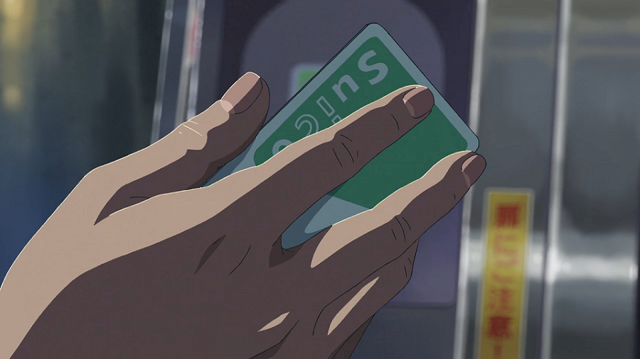 *（截图：言の葉の庭）* 
用于日本全国的交通一卡通，还可以刷自动售货机，比较方便了。（最低2000円购买，其中500为工本费。充值的话都有自动售票机的，有的有中文界面可供选择，不过英语和日语都看得懂。有的机器最低充1000円，触屏的高级点的是500円，搞得我最后卡里面还有三百多没花......）  
这边的地铁内设相比国内要精致一些，车厢内感觉大家都不怎么讲话，都是看手机或者拿着一本小书看，广播用日语和英语一遍遍报站以及建议尽量避免在车上接电话（避免接电话惊到我了）。到站指示屏幕不会一直显示，估计是为了省电，（地铁站里面贴了不少正在为省电努力的海报），所以只好认真听报站，毕竟交通线路有点小复杂，祭上一张线路图，比国内任何城铁都要复杂多了吧，这还只是地下铁。 
  **不过，说得好！我用Google！！** 
*发现地铁有特定时段女性专用车厢，每节车厢里面还有行李架啊，这几点国内可以借鉴*  
穿过一段繁华的*夜生活*街区，11点多终于到达住所了。Airbnb的Check-in并不麻烦，房间不大，里面感觉啥都有就是没有牙膏，收拾的很干净，泡了个澡收拾了下终于妥了。 
*马桶确实高级 [坏笑]* 
*卫生纸敢不敢做的再薄一点一擦就破了*  

#### 欧洲人的光芒
一定要提的是第一天去浅草寺，队长——公认的欧洲人，*武大第一茨木*——在浅草寺抽签，单抽**大吉**\~\~之后我们真的就是一路在**大吉**的光芒下玩耍。之前每天看天气预报都有雨，被**大吉**驱散了。 
*我悄悄地把凶系在柱子上，不能带走*  
上午去的浅草寺、上野公园，感觉游人有一些，但是商铺都还没开。建筑风格跟洛阳那边的仿古建筑一个样，都是盛唐的房屋造型。发现乌鸦真的是多啊，还喜欢叫，一直在耳边啊\~\~啊\~\~\~有点烦，有的乌鸦叫声还特别搞笑，就像是打架打输了在呻吟。  
东京国立博物馆里面除了太刀和盔甲没有什么特别吸引我的，倒是注意到中国明清的藏品特别多，甚至有乾隆的字画，但是标注是日本人捐的，感觉这些八成就是那时抢的吧！  
由于走马观花，首日时间多出来了，慕名去找少年Jump50首年展，结果进去之后有点失望。为了圈钱，原来今年只重点展出80年代以前的作品，明年再搞之后的，结果看过的就屈指可数啊，只有啥龙珠、猫眼、圣斗士、足球小将。来看展览的有很多上年纪的，也有年轻人，毕竟情怀不在这个年代。展厅内不让拍照，只有出来了照一张 
  
然后去新宿站买了地铁通票以及之后要坐的新干线车票，买到手后看新干线车票的价格，三个人想了半天才弄明白：我们要坐5趟车，其中两趟是新干线，然而上面标新干线票钱并不高，甚至比有几趟的普通电车票钱还少，但是总价加起来跟Google上查的是一样的。结果是几张票中一张是总票，新干线的钱分在里面了。就这么解释吧，反正没搞清楚。还有，售票员小哥儿的英语日语口音听得我一愣一愣的，十分迷醉  
出站一看，这不就是诚哥钟爱那栋楼嘛 
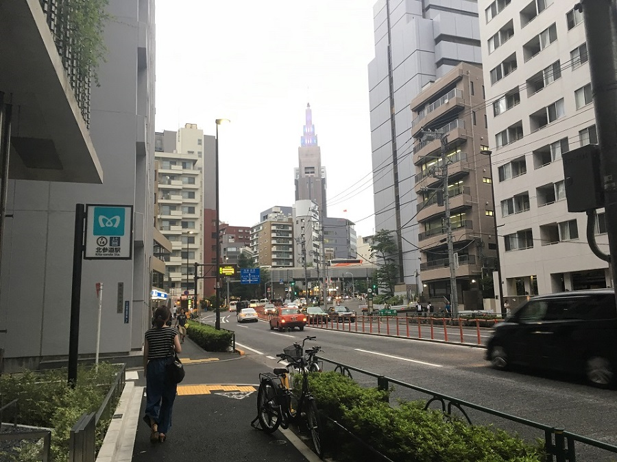 
 
*(截图：君の名は)* 
兴起，新宿御苑就在旁边，走过去发现下午4点就关了。  
晚上准备去吃传说中的[一蘭ラーメン](https://en.wikipedia.org/wiki/Ichiran)，就是火影里面的一乐拉面吧。然而这家店开在歌舞伎町腹地，路上遇到各种拉客，我期初也好奇为啥就知道我们是中国人，直接问的“哥们儿，晚上来玩儿点啥”，直接太强了真受不了...... 
*就不讲在歌舞伎町的见闻了，上张图自己体会（大路上蛮正经的，然鹅走近路串了小巷子）* 
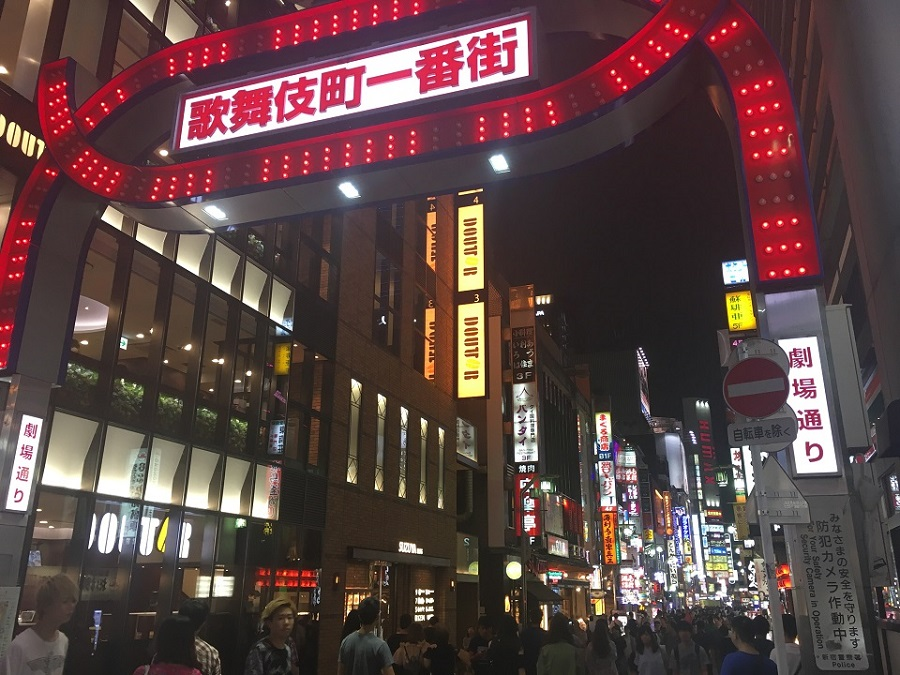 
一兰除了排队时间长、有点贵，真的是蛮好吃。回国之前在大阪又吃了一次。店内的雅座是每个人一个小隔间，隔板也可以拆掉。拉面的做出来的样子虽然说和国内的味千拉面没差多少，但是面和汤味道还是好很多，之后吃过了一般的拉面店就没有这个味道。点餐的时候会自己填一个口味的表格，我要了稍浓的汤，毕竟一碗面780円，然而加面才180円（也许价格有出入，没记记不清了）。好吃到把汤喝干净还有惊喜： 
  
最后，欧洲人的保佑，上午晴天到下午已经乌云密布，就是没下雨 
也是乐了  

#### 管它什么三次元二次元
28、29两日主要的活动我感觉基本上是围绕这个主题展开的。  
跟着两位去豊島区找传说中的“路人坡”，个人表示没看过《路人女主》，所以一趟下来有些懵逼。  
小灰灰可能是由于水土不服发烧了，绕着[皇居](https://en.wikipedia.org/wiki/Tokyo_Imperial_Palace)外围走了半圈，快中午的时候就回[新宿御苑](https://en.wikipedia.org/wiki/Shinjuku_Gyoen)让他找个地方休息，我就四处转转。新宿御苑嘛，也许这个名字不是很熟，但是这个地方： 
 
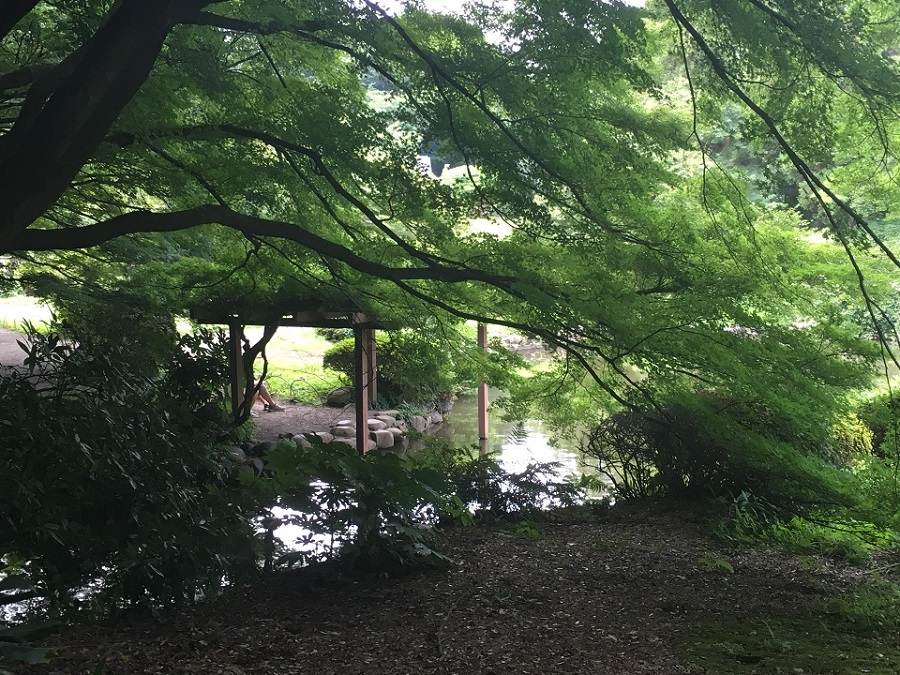 
感觉很多人应该都会熟悉了吧。那个亭子那里根本拍不好照片，全是人。  
能在城市繁华地段保留这么大一片园林感觉很不错了。院内多为小叶枫树，有很多池塘，估计是里面的水更新比较慢的缘故，感觉里面藻类很多，使得池水都特别绿的样子。这天多云转阴，没有下雨，有点小热，感觉是缺少了意境。 
*言の葉の庭看了好几遍再来这个公园感觉很多景象都历历在目，也许肉眼直观感觉这些景没有作品里面那么动人，但毕竟艺术还是高于生活的吧* 
 
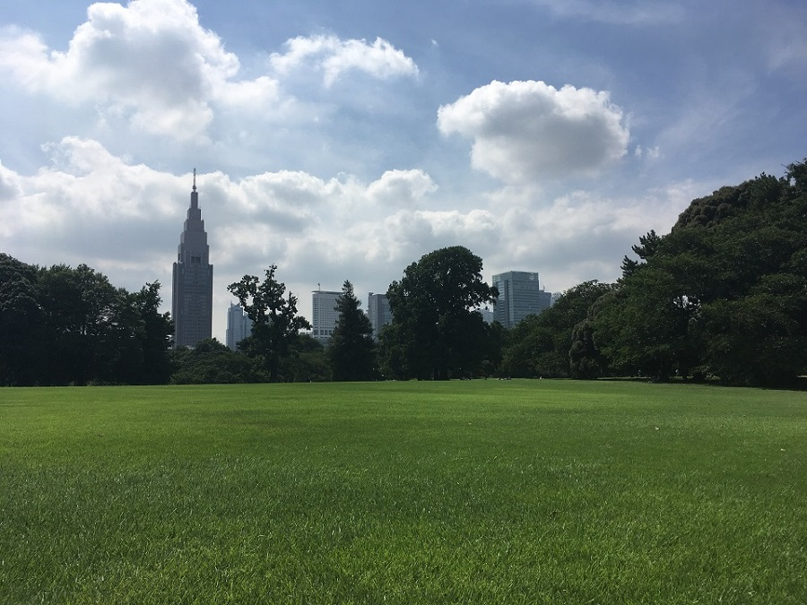  
*另外，这片草皮是可以随便踩的，想躺上面，但是中午还是太晒了* 
***园内禁止饮酒** 香菜是咋喝的啤酒？？*  

快黄昏时去往[东京塔](https://en.wikipedia.org/wiki/Tokyo_Tower)，不料250m平台在维修，现在最高只能去150m平台。等天一暗下来，天花板上的蓝色小灯就亮起来了，影子反射在观景玻璃上，有一种城市上空漫天繁星的感觉。 

    

 
*空调真他喵冷* 
*差点忘了，中途还去了趟銀座，感觉我等屌丝在这种商业街就只有看Price Tag*  

翌日就是整天的秋葉原啦\~\~这天中午还约到正巧在出差的堂哥啦，快四十的人了把他喊道这里见面我也不是很好意思，不知道他看到名曰电器街实则满眼死宅元素会怎么想。  

逛了一会儿就发现这里做的生意都是跟最新的热门作品相关的，那些经典的上了年份的东西并没有，这就很僵硬了。小灰灰是专程为了[LoveLive!Sunshine!!](https://zh.moegirl.org/LoveLive!Sunshine!!)来的，这个我也不看，跟随一同去旁边的神田神社看了看，连神社里面也是LoveLive!Sunshine!!。惊叹于各种[绘马](https://en.wikipedia.org/wiki/Ema_(Shinto))（えま）大触，还有好多国人来祈愿，多是求女票，死宅怎么可能找得到女票😏 
  
在秋葉原的两大动漫商店[Animate](https://en.wikipedia.org/wiki/Animate)、Gamers就逛了好久，然而买的东西虽然又多又齐，**分类也全**（店内有7到8层，每层的内容都不一样，我当然是都看了一遍），然而都是时下流行和热门的，就是好赚钱的。 
  
*看到君の名は才发售不久，特典全集要12000円，想到来日本前一天前网上就有140多G的特典原盘了，没钱的我只有唏嘘不已*  
这边还有很多二手周边店、*音像制品*店，当然二楼三楼我也是去看了，毕竟来了嘛。比较好奇的是租碟的都是些四五十岁的大叔，穿着正式，应该是上班管事的人。看他们细心挑选的样子我没好意思多待。  
小灰灰在[世嘉](https://en.wikipedia.org/wiki/Sega)抓娃娃砸了好多钱还是没成功... 
由于是周末的缘故吧，街道挺热闹的，但是满眼还是宅男，除此之外就路口一些女仆装发转单的，但是说实话好看的也没多少。突然有一种感觉，感觉那些萝莉音都是硬憋出来的，跟这几天偶尔碰到的小朋友说话的感觉一点也不一样，怎么说呢，有一种
>    向之所欲，俯仰之间，已为陈迹，犹不能不以之兴怀

的感觉。  
*引用队长一直感叹的：**业界真是繁荣啊！！*** 
*可是感觉，泡沫不少，宅男经济不可理解* 
*我没在秋葉原买东西*  
晚上找了家烤肉店喝了些清酒，烤肉一般，跟东北的差不太多。在店里点了瓶清酒，20多度没多少大部分一个人喝了，没吃爽又去便利店买了瓶配些饭团宵夜。  
*不算特别好喝，但是比白酒要打头哇*  

#### TO SUM
去之前，我在Google Earth量东京市区的面积比北京市区大不少，人口数量不了解，但是感觉上这边没有北京拥挤。建筑的整体配色为灰色系，也有灰蓝色和墨绿色，看起来比较低调、匀称，但是显得稍许压抑。也许是地理因素或者真的是这里环境治理地很好，街道到处都很干净，没有灰的那种，即便是远离市中心的地方，在外面玩一天自己手上没搓出来什么泥。也许是绿化设计没有裸露的土壤，全拿一种白色的小石子把花坛的土盖着在，刮风也扬不起沙子。交通上比较灵活，行人红绿灯都采用按压式或者夜间按压式，就是要走人的时候按一下让车停在红灯前。但是一般走斑马线的时候，所有的司机隔多远都会停下车让我先走过去，即便是路口左转的车辆（日本是靠左行驶）也会停下来。在新宿站前，道路比较拥堵，但好像也没听到鸣笛。  
城铁没有任何安检措施，检票闸口常开；交通局前会有一个LED显示屏显示昨日因为交通共有多少伤亡；便利店的塑料袋是免费的；道路边没有垃圾桶，垃圾桶只有便利店里和自动售货机旁会有；铁路交通有多家公司运营，有时无法做到站内方便换乘...  
比较可惜的是走之前没有把君の名は拖下来再看一遍，回来了再看诚哥的片子发现这些场景太真实了，绝大多数是新宿、代代木附近的景色，铁路线路标识都是一毛一样的，没有去一趟须贺神社和四谷。  
总体上来讲，只能感叹毕竟是发达国家的首都，我们的祖国还在发展，更有希望。  

### 2.2 沼津篇
期初还为了要不要来这个地方考虑了蛮久的，查到这两天晚上当地有夏日祭以及烟花大会🎆，就决定来玩两天，事实证明，这真是个明智的决定，照片数量说明问题。  
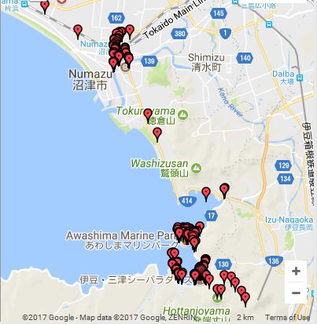

#### 被Aqours盘活的小渔村
我都没有听说过[沼津](https://en.wikipedia.org/wiki/Numazu,_Shizuoka)这个地方，我也没听说过[Aqours](https://zh.moegirl.org/LoveLive!Sunshine!!)，但是在秋叶原看到了好多关于Aqours的东西，应该是目前人气很高的吧。之后才知道沼津Aqours是吧沼津当*根据地*了。  

30号早上JR换乘新干线到的沼津。坐的是光明号（ひかり），然而这高铁的样子跟小时候看的动画片里面一点都不一样了。另外运行中的还有希望号和こだま（回声号？还是和谐号）。高铁运行速度为250km/h，我用GPS测的（*拍照，然后查看记录下的GPS信息，这个方法很好用，还可以用来记录在车站寄存行李的位置*），车厢的显示屏上不会显示车速，而是当日的新闻，今天就一直在滚动播报金将军的洲际导弹测试。除了座位更加宽敞，整体平稳度没国内好。  
两小时车程到达，镇子上看不到什么高楼了，人也比较少。还有好多一看就是外地粉丝赶来应援今天中午的水团（Aqours）活动的。镇子上骑自行车的人有一些，在人行道上碰到后，对方总会下车推，走过后再上车骑起来。  
中午在会场看到了好多小学、初中生跳舞，比较吃惊，节目的编排和创意简直比我们大学一般的舞蹈性质社团要好很多。上午还乌云密布，中午就变大太阳了，小灰灰第二天开始蜕皮了😂然后Aqours就来了，带着全场挥舞着应援手势唱了首歌，我只会跟着瞎划划，然后的然后就尴尬地离开了会场。  
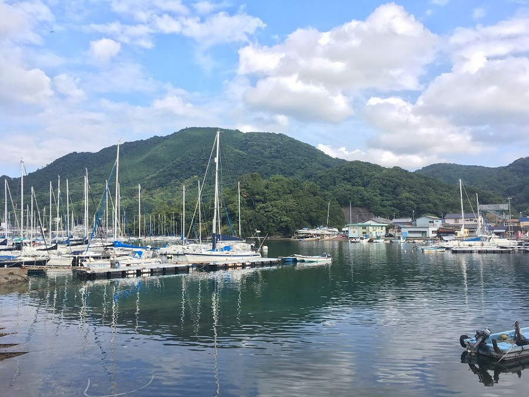  
下午坐大巴车去海湾转转，其实是跟着小灰灰各处巡礼，我就当观光了，风景也蛮好的。这里应该是能远望到富士山的，然而不幸这两天富士山山顶一直被几朵云彩挡着。海湾附近很多水团的主题元素，还碰到很多开[痛车](https://en.wikipedia.org/wiki/Itasha)过来玩的青年，我们也碰巧坐了一次痛巴士。  
电线杆上贴有很多津波（tsunami）注意的标识（我只是第一次看到这个英文外来词汉字写作津波比较好奇），并指示有避难场所。  
兜兜转转，就准备回镇上看烟花大会了。烟花是沿着河两岸布置的，桥上也不让呆人。天还没完全暗，街上两边的小摊就摆起来了，卖一些吃的的玩的，章鱼烧、团子串串（没有我想象中的那么大）、刨冰、苹果糖（比我想象中的大）、香蕉冰激凌、炒面、樱花棒，有玩捞金鱼的摊子，感觉就跟动画里面看的差不多了。人群中有不少穿着浴衣踩着木屐，然后带的有榻榻米铺在地上就几个人坐在河边看烟花了。  
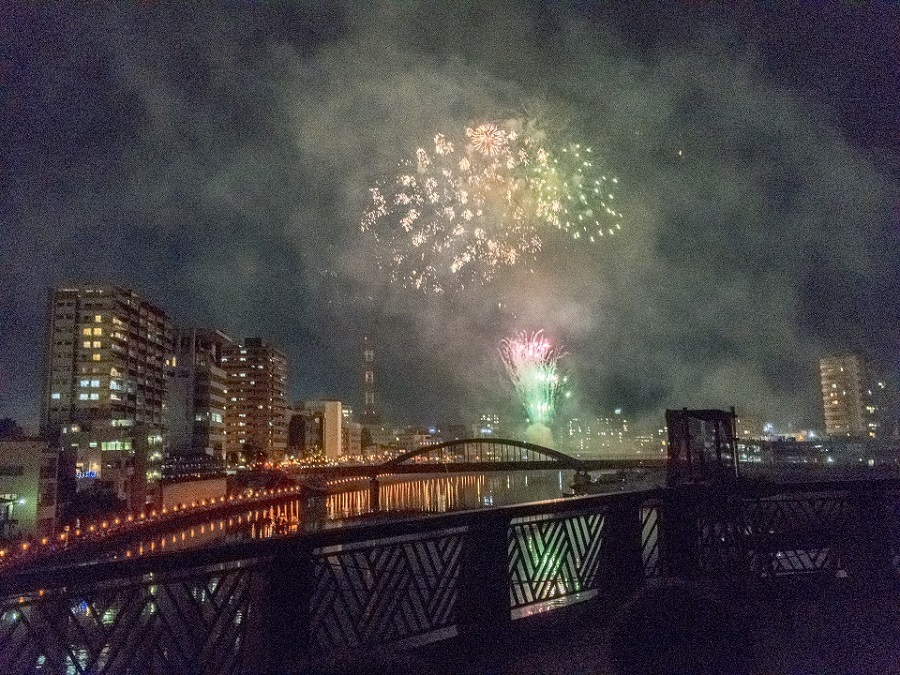  
烟花断断续续放了一个小时，有不同组合的编排，最后压轴的漫天烟花令人印象深刻，瞬间视野内全都是绽放的花火。*视频转GIF也太大，就不放了，当时票圈发过*  
*苹果糖一个真的可以吃好久*😂 
*人群里还是发现了几个比较好看的浴衣小姐姐*   

翌日，还是在海湾附近转悠，去了伊豆三津水族馆，乘船去淡岛，其实也是跟着小灰灰的巡礼路线。 
渔村的水族馆里面果然展出的大部分水生物感觉都是可以吃的呀，超大的石斑鱼呀、帝王蟹、鳗鱼呀，当然还有海洋馆里面常有的海豹海狮海豚。在海豚表演之前，主持姐姐好像是让观众举手参加一会儿的什么活动，没听懂是什么活动，险些举手。然而，这帮人是最后被拉上台被海豚淋水的，全身都湿透了😂  
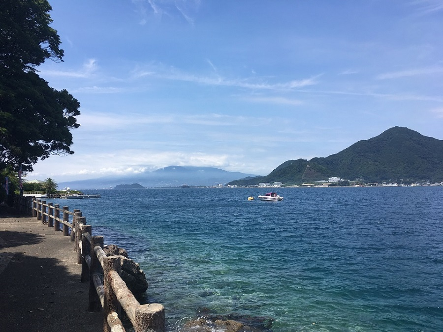  
淡岛这里还有痛船，真的是什么都可以哇。绕岛兜了一圈，爬到山顶的神社看了看，富士山还是一直在云后面,很不给面子。  
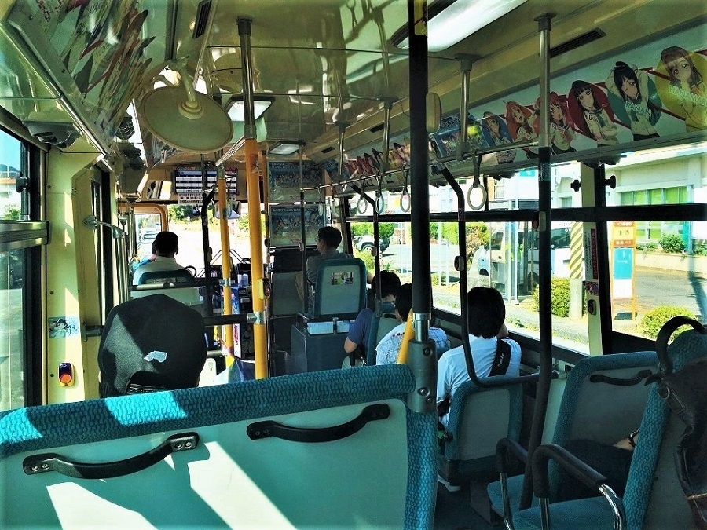  
这几天第一次坐长途巴士。一开始不知道分段计费的方式，上车从票机里领一张号码纸代表上车地点，然后每站车内屏幕上会显示对应号码的价格，下车处有1000円钞票换硬币机。还有就是虽然车站设置的比较密集，但是如果没有等车的人的话司机是不会停车的，要下车的话，按一下车内各个地方设置的按钮，也不用口头呼叫，所以车厢内还是很安静的。  
下午就乘车去京都了，途中路过富士，山顶还是被云挡着在。*今天仍是报道的有阵雨*  
沼津这个地方居住的人还是蛮惬意的，看到好多都是自家门前一个小园林，主人在慢慢修剪松柏，整理石子；也有一家人开着船在海边钓鱼的。随处可见Apours和来朝圣的粉丝，真是感觉是一个乐团撑起了整个镇子的旅游业。  
*酒店的电视可以付费点播小电影*  
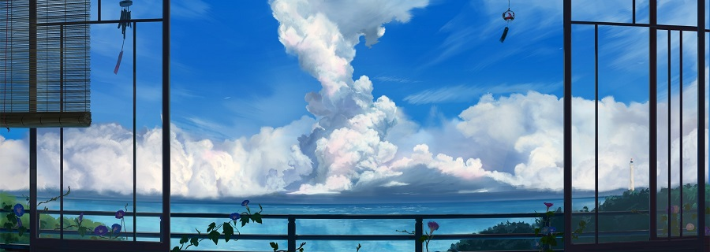 

### 2.3 京都篇

到达京都的时候天已经暗下来了，一开始租的住所是比较和式传统的那种，是在一个杂货集市边上的巷子里。初到京都，感觉都是传统的平房与小巷，然后门前有着自家院落，偏一点的地方没见什么高楼。  
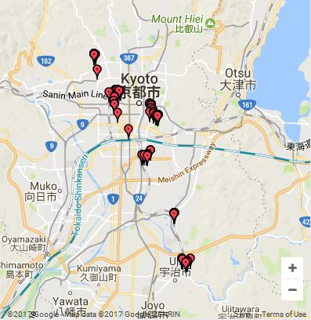  
第一天上午就把清水寺、高台寺、八坂神社大致逛了一遍，因为三者相聚不是很远，就把应该是第二天行程的金阁寺（原名鹿台寺，只不过是那个庙镀了金就都叫这个名字了，旁边貌似还有银阁寺🙈）和二条城也去了。感觉不管是佛教寺庙还是神社，建筑风格都已经在东京见过了，加之自己对此也没有什么信仰，所以很多要出钱进门参拜（参观）的项目都没有去。  
京都的景区这边国人就真的特别多了，还有好多女性应该是租的和服穿着过来玩，但是认真观察的也认得出来：当地穿和服走路都是迈的碎步，且频率比较高，国人的话尽管和服对下肢束缚比较紧，但是还是尽量迈的大步子。（已经找同时在日本玩的我航研究生夏令营队员证实了我的猜想，没想到跟他们的小分队在二条城还碰到了。衣服正面印的BUAA，背面写的こんにちわ，总感觉有点蠢。）由于国人很多，附近的商贩很多都会中文而且还可以，卖包子的大妈对我们特别热情，吃完临走前我们还夸她。景区里面的标识牌五国语言都有好吧。  
到这边来之后不知道为什么有些行人的地方又是靠右了，之前在东京无论什么地方都是靠左走的，然后就喜欢撞。  
晚上找了家居酒屋，本来想点点当地的菜，结果看到菜单就有点懵逼——没有图，只有详细日语菜单和不是很详细的英语菜单。花了二十多分钟点菜还是可以。厨子是在桌子对面做好了就把菜直接端到面前的那种，进门还要拖鞋放在柜子里锁着，感觉比较正式。  
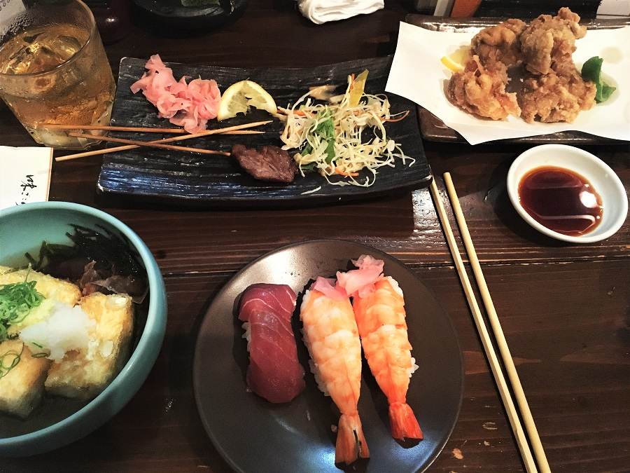  
到达关西，经过一天游玩，还是发现跟关东有一些不同。比如，在口音上，感觉这边把很多轻音都浊化了，甚至在路牌上都看出来了，比如在东京某某大街的什么什么通り对应的英文就写的tori，这边就标的dori。  
另外还有一点好玩的，公交车停车开门的时候，整个车体会往车门的方向倾斜，方便上下，当两扇门都关上的时候车子再正过来启动行驶。 
*地图上还看到了什么晴明神社......到处都是神社*  
第二天一开始准备先去稻荷那边的千本鸟居，结果没注意上了一趟快速车，中间很多小站都不停，所以就先去宇治市逛逛了。去宇治一开始是冲着[Kyoto Animation](https://en.wikipedia.org/wiki/Kyoto_Animation)（京阿尼）去的，到那边去了之后结果看到总部也就是一个三层小平房，周边产品旗舰店也是很小的一个，但是竟然出了那么多著名作品，也是想不到。商店里的留言上好多国人来巡礼，然后看到一个人扭蛋扭了十几次没有扭出康纳ちゃん，感觉心要疼死了。之后在宇治河以及旁边的山上看了看。感觉这里有很多日本游客来玩的，据说茶叶还可以，但是没看到卖的🌚。 
*宇治河闻着还是有点味儿的，就是那种生活污水多了，然后太阳一晒之后的味道*  
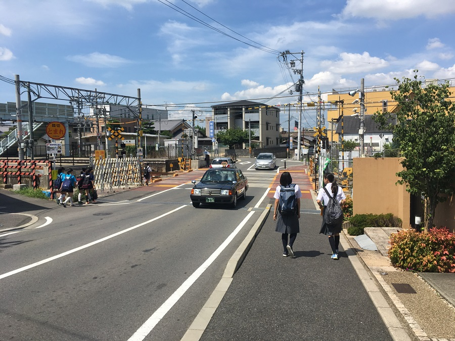  
之后就去伏见稻荷的千本鸟居了，真的是整座山的山路都竖的有大大小小的鸟居，不同大小的价格不一样，反正很贵，都是公司或个人花钱捐的，在背面的柱子上刻的有出资单位。这里的话西洋人游客比例比较高，碰到一个小哥儿正在等人都走了好拍照，我加速通过，走过他时他说了句“Take your time”，然后我的感觉就很好😊。   

在京都玩了两天，主要都是四处走走看看，之后就乘电车去不远的大阪了，我航研会分队已经回国了（好像只在日本玩了6天的样子，而且管得哪里都不让去）。京都这个地方还是比较落后的，尽管看起来很整洁，但是从建筑上就感觉比东京差二三十年。城市里貌似没有地铁吧，这几天市内交通都是公交和电车。城市街道都是东西、南北走向（也有少许斜巷），是个都城的样子，城市四处都有很多古迹，平民住房也较传统。  
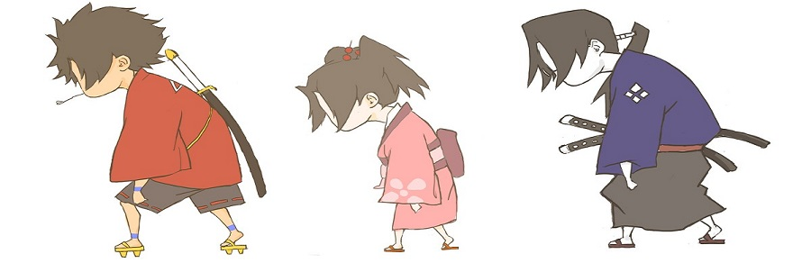 

### 2.4 大阪篇

京都到大阪有便宜的城际特快电车，也有超贵的新干线。住所在新大阪，估计是北岸的开发区，看着不是特别繁华相比南岸的话。（大阪市内河流——淀川——流向是自西向东，然后应该是南岸发达，嗯，这推理应该没错。）  
*这边的列车在候车的时候如果一段时间没人上下，车门就可以关，有人要上下车的时候需要按按钮开门，估计是为了节省冷气和暖气吧。*  
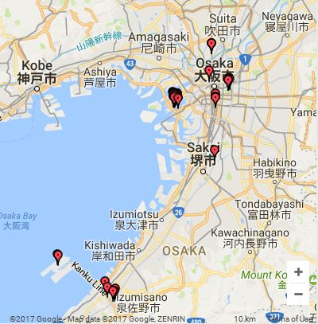  
两日的活动，第一天一整天都去[环球影城](https://en.wikipedia.org/wiki/Universal_Studios_Japan)了，第二天上午看看大阪城天守阁，下午买买东西就准备去机场啦。  

环球影城门票就比较贵了，跟迪士尼乐园一个级别吧，就没买插队票了。作为一个硬盘里还躺着HP几百G原盘的伪哈迷，本来是冲着Harry Potter主题区去的，哦不对，ハリー・ポッター😏环球影城也把这个作为主打。然而，然而，里面配音全是日语啊！违和感爆棚有没有！！连黄头发工作人员也是先说的日语啊！！！心凉了半截。里面的那个Ride in 4K3D——[HAPPY PORTER AND THE FORBIDDEN JOURNEY](https://en.wikipedia.org/wiki/Harry_Potter_and_the_Forbidden_Journey)——真的是超爽的，除了日语配音出戏了，座椅的加速度很足，配合四周立体画面同步剧烈变化，坐火弩箭的带入感超强的，排了块俩小时的队也感觉很值。*摄魂怪做得有点丑（假）。* 在霍格沃兹城堡里面也瞎逛了一圈，里面做了很多那种会动壁画，就是装一块屏幕但是搞的很真实，虽然都是日语🌚。并没有买黄油啤酒喝，看到不含酒精。  
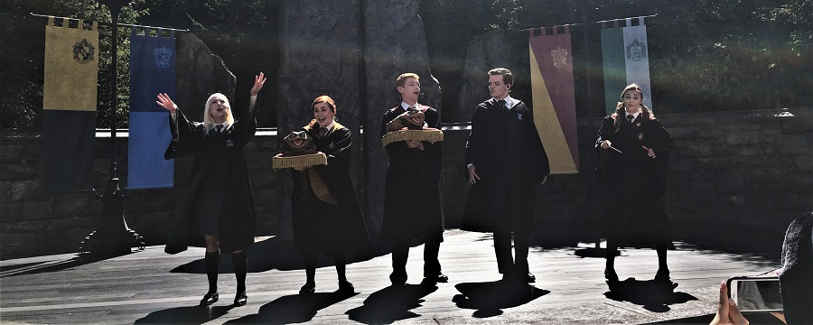 
*除了隆巴顿有只蛤蟆在合唱队还有谁有？？*  
之后还排了很多热门项目。侏罗纪公园主题区的[翼龙过山车](https://en.wikipedia.org/wiki/The_Flying_Dinosaur)以及二十多米落差的[The Flying Dinosaur](https://en.wikipedia.org/wiki/The_Flying_Dinosaur)（激流勇进而已）。过山车不让带任何随身物品，眼睛头巾什么的都包括，不然不让乘坐。排队的时候就在想要是穆斯林想玩怎么办，结果就看到后面排了一个穆斯林小姐姐，道理都懂，结果她还是没玩成，工作人员还是很严格的。还是感觉过山车都是一个尿性啊，尽管这个是把人悬挂起来的，视线比较好，但是还是刚刚让我兴奋就结束了（*后来回来了看wiki才发现这玩意是2016年之前最长的flying roller coaster*）。激流勇进**有幸**坐在第一排，开始排队的时候看视频里的感觉应该不会湿，还信誓旦旦跟队长解释，结果我坐在第一排最边上，最后一个20多米的坡一下去，冲起来的水直接沿着船沿往我脸上打😆 
Despicable Me主题那块还是太热门了，都是大人带小孩子，就没有排小黄人的Ride。之后去坐了Spider Man的RIde，感觉没有HP的那个刺激，但是也还行，很多人物都是动画片里面的，有些不是很熟悉。其实印象最深的就是排这个队的时候队长看上了后面的一个双马尾JK，然后一直在碎碎念，内心演绎了一百万种搭讪方法，演绎。其实嘛，我在排HP的时候就看到了😏 
有点遗憾的是剧场里面今天没有放龙珠的特别视频，放的是JoJo的，应该还是少年Jump的五十周年合作项目，然而并没有看过。  
晚上回去的时候，好心的中国大叔（应该是在这边定居的）提醒我们坐错车了，应该要换乘了。这边铁路设计的也比较复杂，有些列车可以不换乘，然后到一个站后换上另一个名字接着开；有些还分车厢，比如到一个站后，前4节车厢接着开，后4节断开和另外的合并后返回（*第二天去机场的时候就碰到了这样的车，Google上也只是说明不需换乘直接到机场，然而在车上看滚动LED上面的英语提示才发现不对劲，找了个应该会停的时间长一点的车站，从8车厢飞奔到4车厢，后来还看到了彩虹，心情蛮好的。这样做应该是为了效率吧，我也只能是这么解释了*）。晚上吃到了吃过的最好吃的咖喱炸猪排饭。  

大阪城天守阁这个季节来好热啊，也是把以前的建筑改成一个历史博物馆了。转到下午，又去吃了一兰拉面，要了最浓的汤全喝完了。*在店里看到估计是大堂经理，督促一个实习小哥一直在擦地板，就那一块地板擦了好久，跪在地上仔细擦的那种*。去帮亲友找产品，三个汉子在药妆店逛来逛去，然后还是在Gamer里面买了个贝特鲁吉乌斯·罗曼尼康帝的钥匙链😏*谁呀，没听说过这个角色* 
在关西机场花完了剩下不多的现金。*机场里有些商店刷支付宝还打85折\~*  
晚上北京时间11点到达上海浦东机场，一下飞机还是熟悉的味道。*海关没有我想象中的那么严格啊。* 要去虹桥，被各种黑车拉客附带欺骗说我们这就是机场夜班车。到了虹桥站，这里晚上要关站清人，保安小哥还是蛮热心的，帮我们联系钟点房接过去了。    

**如此，九夜十日**    

## 3 攻略
*一年之后的更新* 
  鸽了，一是不想写了，二是觉得写了也没什么必要了，没多少人会来看看了。 

所以我打算在闲暇的时候写写评论吧~就这样。。。  

 [返回目录](#目录)

<!--

  */

| Tables        | Are           | Cool  |
| ------------- |:-------------:| -----:|
| col 3 is      | right-aligned | $1600 |
| col 2 is      | centered      |   $12 |
| zebra stripes | are neat      |    $1 |

-->